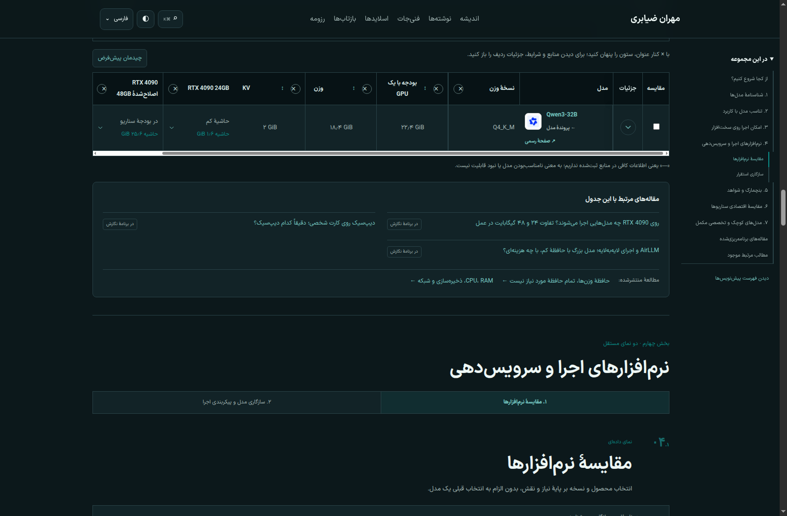
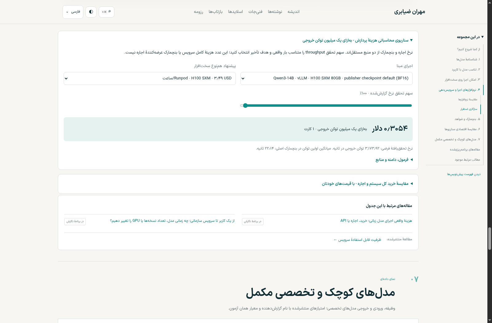

# نسخهٔ محلی راهنمای LLM با پژوهش ۰.۲.۰

داده‌ها روی نسخهٔ محلی ادغام شده‌اند. کاور و باکس «از کجا شروع کنیم»، ستون‌های قابل پنهان‌کردن، جزئیات بازشونده، پروندهٔ مشترک مدل، اعداد فارسی و لوگوهای محلی حفظ شده‌اند. انتشار عمومی، کامیت و پوش در این مرحله انجام نشده است.

## اجرا و مسیرهای بازبینی

پیش‌نمایش آماده: [راهنمای LLM](http://127.0.0.1:4189/guides/llm/?show-drafts=true).

برای ساخت و راه‌اندازی مجدد از ریشهٔ پروژه:

```bash
npm run build
PORT=4189 npm run preview:local
```

| نما | مسیر محلی | دادهٔ قابل بررسی |
|---|---|---|
| شناسنامه | [مدل‌ها](http://127.0.0.1:4189/guides/llm/?show-drafts=true#model-catalog) | ۵۹ مدل؛ ۱۲۷ نسخهٔ دریافت؛ فایل GGUF برای ۱۹ مدل |
| کاربرد | [راهنمای کاربرد](http://127.0.0.1:4189/guides/llm/?show-drafts=true#model-suitability) | ۱۰ نقطهٔ شروع، ۵۹ پرونده و ماتریس اختیاری ۵۰ مدل مولد |
| حافظه | [امکان اجرا](http://127.0.0.1:4189/guides/llm/?show-drafts=true#hardware-feasibility) | ۲۸ فایل‌بندی وزن، ۱۵ آرایش GPU، پنج ردهٔ RAM، سه مدل SmolLM2 در مسیر FP32، سه گزارش AirLLM و دو ادعای GPT-OSS |
| نرم‌افزار | [انتخاب ابزار](http://127.0.0.1:4189/guides/llm/?show-drafts=true&view=software-products#serving-software) | ۱۳ ابزار؛ راهنمای کاربرد و شرط انتخاب ۱۱ ابزار تکمیل شد |
| سازگاری | [مسیرهای اجرا](http://127.0.0.1:4189/guides/llm/?show-drafts=true&view=deployment-compatibility#serving-software) | ۵۴ مسیر مدل/موتور و ۱۲ ردیف پشتیبانی کرنل |
| کارایی | [آزمون‌های منتشرشده](http://127.0.0.1:4189/guides/llm/?show-drafts=true#benchmarks) | ۴۰ اجرای گزارش‌شده در هفت گروه؛ معیارها و شرایط جدا |
| هزینه | [اجاره و محاسبهٔ هزینه](http://127.0.0.1:4189/guides/llm/?show-drafts=true#economics) | ۱۶ پیشنهاد، ساعات قابل تغییر، سناریوی هزینهٔ توکن و مقایسهٔ خرید کل سیستم/اجاره |
| مدل تخصصی | [بازیابی و بازرتبه‌بندی](http://127.0.0.1:4189/guides/llm/?show-drafts=true#specialized-models) | ۹ مدل؛ نتایج کیفیت و حافظهٔ بردارهای خام در محل مرتبط |

## چه داده‌ای اضافه شد؟

بستهٔ جدید جایگزین داده‌های قبلی نشده است. از ۶۴ امتیاز کیفیت، ۳۳ مورد با نتایج قبلی مشترک بود؛ منابع آن‌ها تکمیل شد و ۳۱ نتیجهٔ تازه اضافه شد. اکنون ۶۸ امتیاز برای ۱۶ مدل داریم. واحد Codeforces همان rating باقی مانده، دو حالت تفکر جدا هستند و امتیاز مدل پایه به فایل Q4 یا Q8 تعمیم داده نشده است.

۲٬۱۶۰ خانهٔ ماتریس‌های ورودی، محاسبهٔ حافظه‌اند؛ ۴۰ رکورد کارایی، اجرای گزارش‌شده‌اند. ماتریس‌های بزرگ به مرورگر ارسال نمی‌شوند و با تغییر زمینه، درخواست فعال و آرایش کارت بازحساب می‌شوند. در نمای قیمت، ارزها جدا می‌مانند و عدد سربه‌سر، نسبت نرخ‌هاست. قیمت خرید ایران و نرخ تبدیل ارز ساخته نشده است.

نام مدل در جدول‌ها همان پروندهٔ مشترک را باز می‌کند. بخش «حافظه و اجرا» به آن اضافه شده و لینک بازگشت به جدول، مدل و گروه دادهٔ مناسب را انتخاب می‌کند. جزئیات سناریوی هر ردیف جدا باز می‌شود. لوگوهای Runpod و Trooper نیز از سایت رسمی دریافت و محلی ذخیره شدند؛ لوگوهای مدل، نرم‌افزار و NVIDIA از مجموعهٔ محلی سایت استفاده می‌کنند.

پیوند به راهنمای GPU و مقاله‌های مرتبط با حافظه، سرعت، کرنل و استقرار بررسی شد. مقاله‌های پیشنهادی بخش کارایی بر انتخاب موتور و سرویس هم‌زمان متمرکز شدند. مقالهٔ `secure-rag-agent` هنوز پیش‌نویس است و لینک عمومی فعال به آن ساخته نشد. ۱۴ مقالهٔ برنامه‌ریزی‌شده نیز به مدخل نقشهٔ نگارش پیوند دارند، نه صفحهٔ مقالهٔ نوشته‌نشده.

## مثال‌های قابل بازبینی

1. در حافظه، `Qwen3-32B` و `Q4_K_M` را انتخاب کنید: زمینهٔ ۸٬۱۹۲ و یک درخواست حدود **۲۲٫۴۰ GiB** بودجه دارد. زمینهٔ ۳۲٬۷۶۸ آن را به **۲۸٫۴۰ GiB** و هشت درخواست با زمینهٔ ۸٬۱۹۲ به **۳۶٫۴۰ GiB** می‌رساند. دو کارت ۲۴ گیگابایتی با برچسب «نیازمند تقسیم مدل» مشخص‌اند.
2. مسیر CPU و `SmolLM2-1.7B-Instruct`: با زمینهٔ ۸٬۱۹۲ و یک درخواست، برآورد FP32 حدود **۱۳٫۳۸ GiB RAM** است. این عدد برآورد سرعت پاسخ نیست.
3. در سازگاری، وظیفهٔ «بردارسازی» سه مسیر TEI را نشان می‌دهد. در نمای کرنل، Ampere پشتیبانی AWQ، GPTQ و Marlin را از پیاده‌سازی FP8 W8A8 فاقد پشتیبانی جدا می‌کند.
4. در کارایی، گروه Qwen14/H100 نتیجهٔ vLLM را با **۳٬۱۷۳٫۹۲ توکن خروجی/ثانیه** و **۲۲٫۱۴ ثانیه** میانگین اولین توکن نشان می‌دهد. گروه H20 معیار مجموع ورودی و خروجی دارد؛ گروه وزن تصادفی به مدل آموزش‌دیده وصل نشده است.
5. در هزینه، پیشنهاد H100 SXM با ۷۳۰ ساعت، **۲٬۵۴۷٫۷۰ دلار** می‌شود. با نصف‌کردن سهم تحقق throughput در محاسبهٔ هزینهٔ توکن، هزینهٔ واحد دو برابر می‌شود. پیشنهاد یورویی Trooper در گروه مستقل باقی می‌ماند.
6. در مدل تخصصی، Qwen3-Embedding-0.6B برای یک میلیون بردار خام FP32 با ابعاد پیش‌فرض حدود **۳٫۸۱ GiB** دارد؛ حافظهٔ مدل، ساختار جست‌وجو و فراداده جدا هستند.

اعداد اجرا و کیفیت به گزارش اصلی منتسب‌اند؛ مدل‌ها در این محیط اجرا نشده‌اند. داده‌های قیمت، snapshot تاریخ گردآوری هستند. [گزارش تفصیلی ادغام و موارد کنارگذاشته‌شده](../../../../data/llm/v0.2.0/integration/README.fa.md) و [بازبینی منابع](../../../../data/llm/v0.2.0/integration/source-review.json) همراه داده‌ها ذخیره شده‌اند.

## آزمون‌ها

- `npm run check`: صفر خطا و صفر هشدار.
- `npm test`: ۱۱۲ آزمون موفق، شامل آزمون‌های هویت، ادغام، واحدها، ۲٬۱۶۰ خانهٔ حافظه، ۲۰ مثال هزینه و اثر واقعی فیلترها.
- `python3 data/llm/v0.2.0/validate.py`: ۱۸٬۷۴۲ کنترل داخلی موفق.
- `npm run build`: موفق؛ ۱۶۸ صفحهٔ قابل ایندکس، ۱۷۷ بلوک JSON-LD و ۲۰۴ مقصد لینک کوتاه معتبر.
- `npm run verify:local`: ۱۷۹ صفحه، صفر خطا و صفر مشکل fragment.
- [آزمون مرورگر جداول جدید](browser-review.json): دسکتاپ، موبایل ۳۹۰ و ۳۲۰ پیکسل، هر دو پوسته، فیلترها، پرونده‌ها، لینک‌ها، تصاویر محلی و دروازهٔ پیش‌نویس.
- [رگرسیون چهار جدول قبلی و پرونده‌ها](regression/browser-review.json): کاور کنار باکس شروع، ماتریس اختیاری، لوگوهای هم‌اندازه، دریافت، اجرای درست مدل تخصصی، لینک مستقیم پرونده و فوکوس صفحه‌کلید.
- [بررسی سربرگ در سه زبان](header-review.json): صفحهٔ اصلی و آرشیو فارسی، انگلیسی و اسپانیایی در عرض ۳۲۰ پیکسل، بدون بیرون‌زدگی صفحه.

در عرض ۳۲۰ پیکسل، ابزارهای سربرگ مشترک باعث جابه‌جایی افقی کل صفحه می‌شدند. فاصله‌های سربرگ در عرض‌های تا ۴۰۰ پیکسل اصلاح شد؛ اسکرول افقی جدول‌ها داخل کادر خودشان باقی می‌ماند.

## تصاویر

۳۲ تصویر از نماهای جدید و ۲۳ تصویر رگرسیون ثبت شده‌اند. نمونه‌های اصلی:

| تصویر | مسیر |
|---|---|
| کاور و باکس شروع | [دسکتاپ](desktop-start.png) |
| کنترل سناریوی حافظه | [دسکتاپ](desktop-memory-controls.png) |
| مقایسهٔ حافظهٔ یک و دو کارت | [جدول](desktop-memory-8k.png) |
| جزئیات محاسبه | [جزئیات ردیف](desktop-memory-details.png) |
| پروندهٔ مدل | [حافظه و اجرا](desktop-model-memory.png) |
| CPU و مدل کوچک | [جدول CPU](desktop-cpu.png) |
| اجرای لایه‌ای | [AirLLM](desktop-airllm.png) |
| سازگاری | [مسیر TEI](desktop-embedding-route.png) · [کرنل‌ها](desktop-kernel-support.png) |
| کارایی | [گزارش GPUStack](desktop-performance.png) · [وزن تصادفی](desktop-synthetic-scope.png) |
| هزینه | [اجارهٔ یورویی](desktop-rental-eur.png) · [هزینهٔ توکن](desktop-token-cost.png) · [مالکیت](desktop-ownership.png) |
| موبایل ۳۲۰، تیره | [حافظه](mobile-320-dark-hardware-feasibility.png) · [سازگاری](mobile-320-dark-deployment-compatibility.png) · [کارایی](mobile-320-dark-benchmarks.png) · [هزینه](mobile-320-dark-economics.png) |
| موبایل ۳۲۰، روشن | [حافظه](mobile-320-light-hardware-feasibility.png) · [سازگاری](mobile-320-light-deployment-compatibility.png) · [کارایی](mobile-320-light-benchmarks.png) · [هزینه](mobile-320-light-economics.png) |




