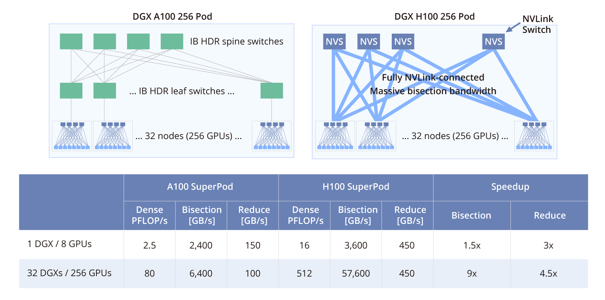
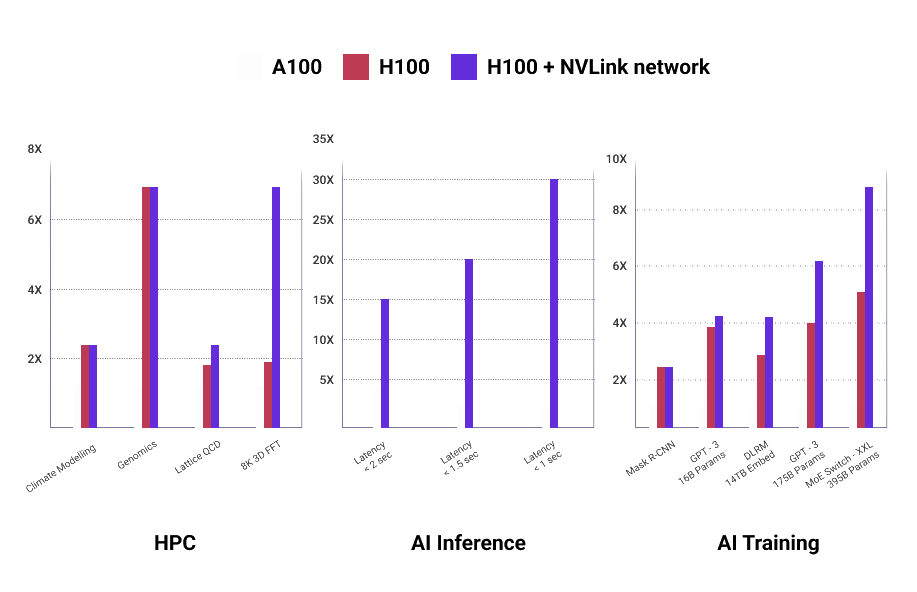

### انواع رابط‌های اتصال

در گذشته تنها رابط PCIe برای پردازنده‌های گرافیکی مورد استفاده بود اما با رشد و پیشرفت هوش مصنوعی و نیاز به دستیابی به سرعت‌های بالا برای انتقال اطلاعات میان پردازنده‌ها نوعی رابط جدید ایجاد شد که در کارت‌های Nvidia با عنوان [^27]SXM بر روی سرورهای DGX و HGX شناخته می‌شود.

معماری SXM یک راهکار با پهنای باند بالا برای اتصال شتاب دهنده های هسته تنسور NVIDIA به سیستم اختصاصی DGX و HGX است. بردهای سیستم تخصصی HGX مجموعه‌ای از 8 پردازنده گرافیکی را از طریق NVLink به هم متصل می‌کنند و پهنای باند بالای GPU به GPU را فراهم می‌سازند.. قابلیت‌های NVLink داده‌ها را بین پردازنده‌های گرافیکی بسیار سریع جریان می‌دهد و به آن‌ها اجازه می‌دهد تا به‌عنوان یک واحد پردازنده گرافیکی واحد عمل کنند و داده‌ها را بدون عبور از باس PCIe یا نیاز به برقراری ارتباط با CPU مبادله کنند.

در مرکز داده و صنعت هوش مصنوعی مشخص است که NVIDIA DGX به معنای واقعی کلمه طلا است. بهترین از بهترین و قدرتمندترین دستگاه هوش مصنوعی. برجسته ترین آنها آموزش OpenAI ChatGPT در سیستم NVIDIA DGX آنها است. در واقع، OpenAI در سال 2016 یکی از اولین سیستم‌های NVIDIA DGX-1 را از NVIDIA دریافت کرد.

شرکت‌های بزرگ به سراغ NVIDIA DGX می‌روند نه به دلیل قوی بودن، بلکه به دلیل توانایی آن در مقیاس‌پذیری. پردازنده‌های گرافیکی SXM با هشت پردازنده گرافیکی H100 که به طور کامل با فناوری اتصال NVLink و NVSwitch به هم متصل هستند، برای استقرار در مقیاس بالا مناسب‌تر هستند. در DGX و HGX نحوه اتصال 8 GPU SXM با PCIe متفاوت است. هر GPU به چندین تراشه NVSwitch متصل است که امکان عملکرد یکپارچه و هماهنگ همه GPUها را فراهم می‌کند. این مقیاس‌پذیری می‌تواند با NVIDIA NVLink Switch System گسترش بیشتری یابد تا ۲۵۶ DGX H100s را به کار گرفته و به آن متصل کند تا یک کارخانه هوش مصنوعی شتاب‌دار GPU ایجاد کند.

در رابط PCIe نیز می‌توان ارتباط مستقیم بین کارت‌ها برقرار کرد، اما این ارتباط معمولاً از طریق NVLink Bridge تنها بین جفت‌های GPU امکان‌پذیر است.. بنابراین GPU‌هایی که ارتباط مستقیم نداشته باشند فقط می توانند داده‌ها را از طریق خطوط PCIe برقرار و در نتیجه از CPU استفاده کنند. با دور زدن خطوط PCI Express هنگام تبادل داده بین پردازنده‌های گرافیکی، پردازنده‌های گرافیکی سریع SXM می‌توانند حداکثر توان عملیاتی را با کندی کمتر نسبت به همتای PCIe خود به دست آورند، که برای آموزش مدل‌های هوش مصنوعی بسیار بزرگ که حجم عظیمی از داده برای آموزش استفاده می‌شود، عالی است.

NVIDIA DGX بهترین مقیاس‌پذیری را دارد و عملکردی را ارائه می‌دهد که با هیچ سرور دیگری در فرم فاکتور آن قابل مقایسه نیست. اتصال چندین NVIDIA DGX با سیستم‌های NVSwitch می‌تواند چندین DGX H100 را به SuperPods برای آموزش مدل‌های بسیار بزرگ تبدیل کند. با این حال، مهم‌ترین نقطه ضعف معماری SXM انعطاف‌پذیری محدود آن در پیکربندی است، زیرا این معماری برای سیستم‌های خاص مانند DGX طراحی شده و برای کاربردهای متنوع‌تر مناسب نیست. در اصل این معماری صرفا برای کارهای حجیم مناسب بوده و برای کارهای معمولی انعطاف لازم را ندارد.

نوع PCIe برای کسانی است که با حجم کاری کوچک‌تر کار می‌کنند و خواهان انعطاف‌پذیری نهایی در تصمیم‌گیری تعداد پردازنده‌های گرافیکی در سیستم هستند. این پردازنده‌های گرافیکی از نظر عملکرد بسیار خوب هستند و سهولت در قرار گرفتن در هر زیرساخت محاسباتی این GPU ها را قانع کننده می‌کند. برعکس مدل‌های DXG که سرورهای بزرگ معمولا ۸ یونیت دارند کارتهای PCIe می‌توانند در سرورهایی از یک یونیت به بالا به کار برده شوند.

از طرف دیگر باید به این نکته توجه داشت که استفاده از توان پردازشی SuperPODها در همه الگوریتم‌ها ممکن نیست و در برخی موارد، به دلیل محدودیت‌های نرم‌افزاری، انتقال داده‌ها از طریق CPU و رابط PCIe انجام می‌شود. در عین حال بهره‌گیری از توان SuperPOD ها نیازمند لایسنس‌های اختصاصی است.

مهمترین وجه تمایز این دو نوع رابط سرعت انتقال داده‌ها بین کارت‌های گرافیکی و همچنین امکان بهره‌گیری از NVLinkSwitch برای ارتباط بین سرورها است. در نتیجه در شرایط زیر انتخاب رابط SXM اشتباه است:

- استفاده از کارت‌های گرافیکی به صورت مستقل از هم

- عدم بهره‌گیری از NVLinkSwitch برای ارتباط بین سرورها

- عدم توانایی فنی یا ناتوانی تیم بهره‌بردار در بهینه‌سازی نرم‌افزار برای استفاده یکپارچه از خوشه[^28] پردازنده‌های گرافیکی

مقایسه‌های انجام‌شده بین دو نسخه H100 PCIe و H100 SXM نشان می‌دهد که اگرچه از نظر تعداد هسته‌ها مشابه هستند، اما تفاوت‌های کلیدی در پهنای باند حافظه و اتصال NVLink وجود دارد. نتایج این مقایسه‌ها به صورت نمایش‌داده‌شده در است:

#### پهنای باند و سرعت انتقال داده

هر دو پردازنده گرافیکی NVIDIA H100 ارتقای قابل‌توجهی در قابلیت‌های حافظه داشته‌اند. هر دو نسخه SXM5 و PCIe از حافظه HBM3 استفاده می‌کنند، اما نسخه SXM5 پهنای باند حافظه تا 3 ترابایت بر ثانیه و ظرفیت تا 141 گیگابایت ارائه می‌دهد، در حالی که نسخه PCIe پهنای باند حدود 2 ترابایت بر ثانیه و ظرفیت 80 گیگابایت دارد. مدل‌های NVIDIA H100 از فناوری به‌روزشده NVIDIA NVLink و NVSwitch بهره می‌برند که در پیکره‌بندی‌های مبتنی بر چندین GPU، توان عملیاتی بیشتری را ارائه می‌دهند.

#### بهره وری انرژی و مصرف برق

پردازنده‌های گرافیکی H100 نسبت به نسل‌های قبلی خود از نظر انرژی کارآمدتر هستند. مدل H100 PCIe مصرف توان 350 وات دارد که مشابه یا کمی بالاتر از توان مصرفی A100 80GB PCIe (حدود 400 وات) است. نسخه SXM5 تا 700 وات توان مصرفی دارد، اما همچنان بهره‌وری انرژی بهتری نسبت به A100 ارائه می‌دهد.

#### کارایی و کاربرد

در حوزه کارایی و کاربرد دو نوع PCIe و SXM جدول ذیل به خوبی این دو رابط را با هم مقایسه می‌کند:

|                                                                                                                                                                                                                                                                                |                                                                                                                                                                                                                                                                                                                                     |
|--------------------------------------------------------------------------------------------------------------------------------------------------------------------------------------------------------------------------------------------------------------------------------|-------------------------------------------------------------------------------------------------------------------------------------------------------------------------------------------------------------------------------------------------------------------------------------------------------------------------------------|
| NVIDIA H100 PCIe                                                                                                                                                                                                                                                               | NVIDIA H100 SXM                                                                                                                                                                                                                                                                                                                     |
| **تجزیه و تحلیل داده های با توان بالا:** این فناوری برای پردازش مجموعه داده های عظیم در زمان واقعی مناسب است، که برای تشخیص تقلب، شناسایی ناهنجاری ها و ارائه توصیه های شخصی ضروری است. رابط PCIe از انتقال داده با سرعت بالا پشتیبانی می کند که برای این وظایف بسیار مهم است. | **شبیه سازی HPC در مقیاس بزرگ:** SXM H100 برای اجرای شبیه سازی های علمی و مهندسی پیچیده که به قدرت محاسباتی و پهنای باند حافظه عظیم نیاز دارند، طراحی شده است. این به این دلیل است که فاکتور فرم SXM امکان ارتباط مستقیم بیشتری با CPU و سایر GPU ها را فراهم می کند که برای بارهای کاری محاسباتی با کارایی بالا (HPC) ایده آل است. |
| **تصویربرداری و تشخیص پزشکی:** تجزیه و تحلیل تصاویر و فیلم های پزشکی به سرعت و دقت نیاز دارد که H100 PCIe می‌تواند ارائه دهد. توان عملیاتی بالای H100 PCIe به پردازش سریع مجموعه داده‌های پزشکی بزرگ کمک می‌کند و منجر به تشخیص سریع‌تر و دقیق‌تر می‌شود.                            | **آموزش مدل هوش مصنوعی در مجموعه داده های عظیم:** آموزش مدل های پیچیده هوش مصنوعی مانند مدل های زبان بزرگ به منابع محاسباتی قابل توجهی نیاز دارد که SXM H100 می تواند فراهم کند. اتصالات مستقیم GPU-GPU در فرم فاکتور SXM می تواند با بهبود نرخ انتقال داده و کاهش تأخیر به سرعت بخشیدن به روند آموزش کمک کند.                      |
| **طراحی تعاملی و تجسم: **برای رندر زمان واقعی مدل‌ها و شبیه‌سازی‌های پیچیده سه‌بعدی، سرعت انتقال داده سریع H100 PCIe سودمند است. این می تواند به ویژه در برنامه‌های طراحی و مهندسی که بازخورد بصری فوری ضروری است مفید باشد.                                                        | **کشف دارو و علم مواد: **SXM H100 می‌تواند کشف داروها و مواد جدید را از طریق شبیه‌سازی‌هایی با توان عملیاتی بالا تسریع بخشد. این وظایف اغلب شامل پردازش حجم وسیعی از داده ها و اجرای الگوریتم های پیچیده است که می تواند از قابلیت های محاسباتی و پهنای باند حافظه افزایش یافته SXM H100 بهره مند شود.                                 |

[^27]: Server PCI Express Module

[^28]: Cluster
